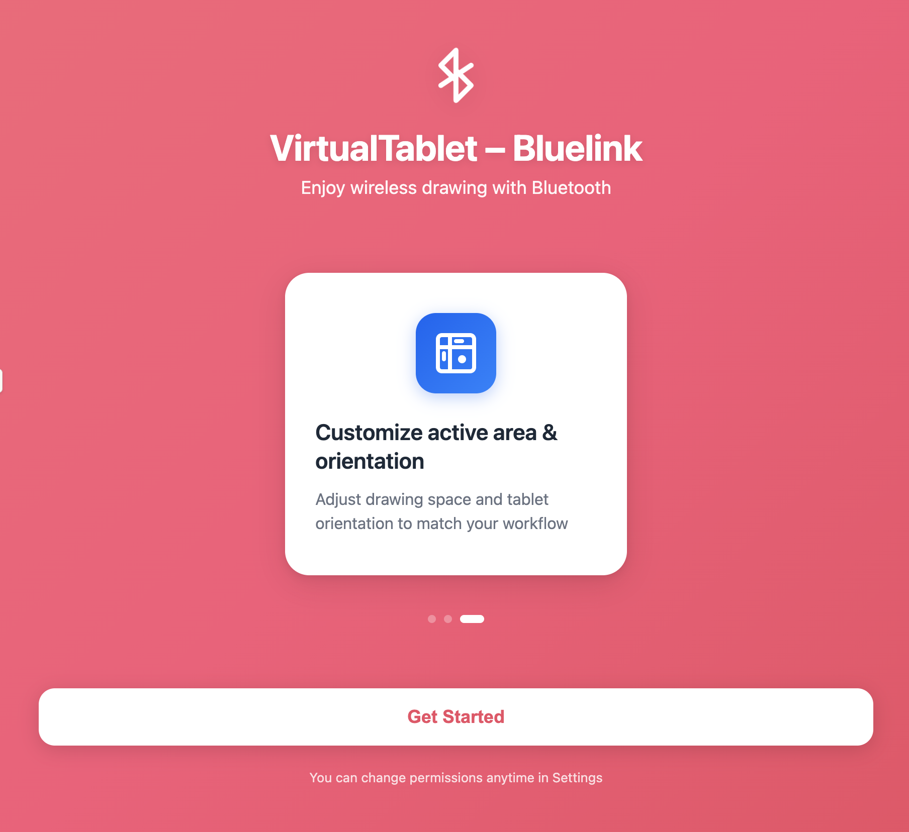
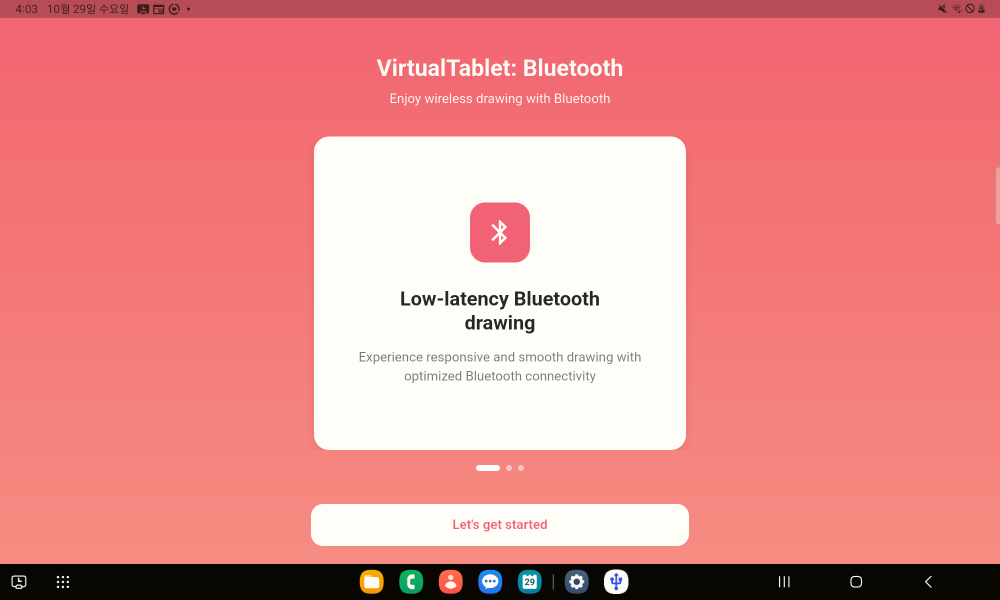
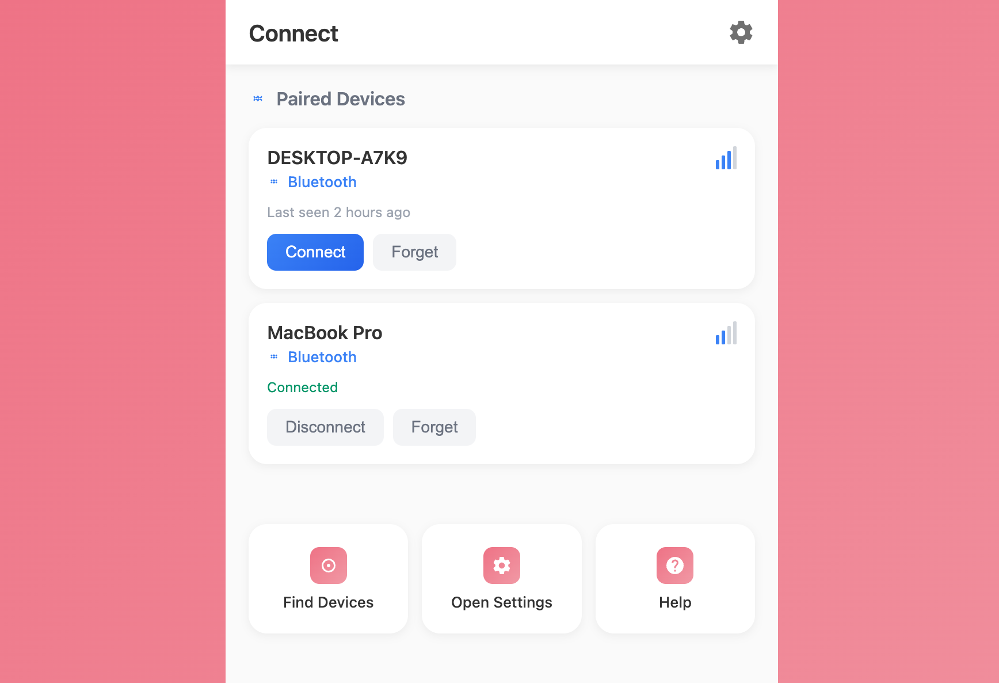
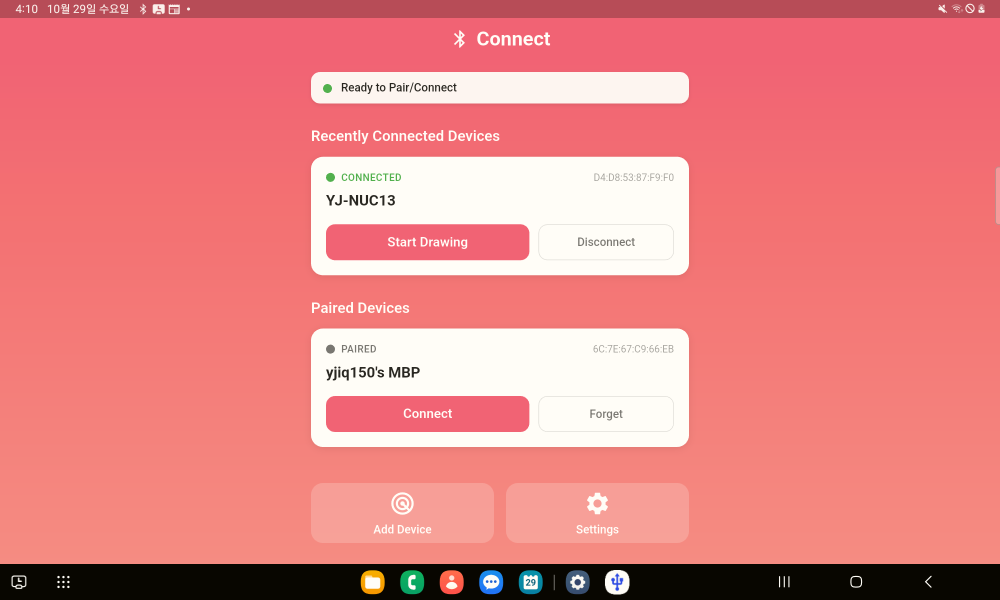
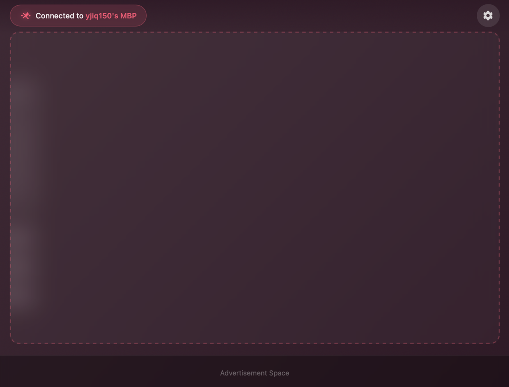
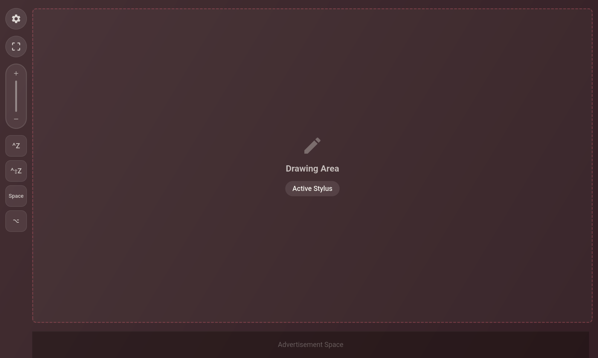
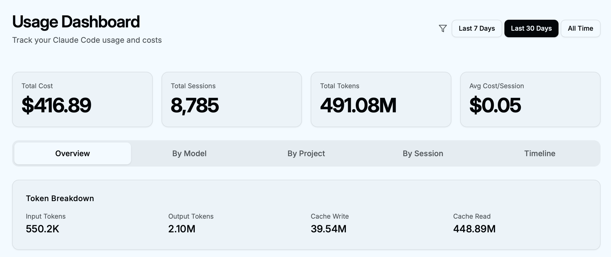

최근 약 2개월간 진행했던 사이드
프로젝트, [VirtualTablet: Bluetooth](https://www.sunnysidesoft.com/ko/virtualtablet-bluetooth/) 버전 개발기를
정리하고자 한다. 이번 프로젝트는 **Claude Code**를 활용하여 1인 개발의 한계를 어디까지 확장할 수 있는지 실험해본 과정이기도 했다.

## 1. 개발하게 된 계기

원래 10년 전쯤 개발하여 유지보수 하던 [VirtualTablet](https://www.sunnysidesoft.com/ko/virtualtablet/)이라는 앱이 있었다.
이 앱만 있으면 와콤 태블릿 같은 하드웨어를 별도로 구매하지 않아도, 기존에 집에서 쓰던 갤럭시 탭이나 갤럭시 노트/울트라 같이 S Pen 지원하는 장치를 PC에 연결해서 태블릿
처럼 쓸 수 있게 해 준다.
기본 원리는 안드로이드 클라이언트(태블릿)에서 S Pen 입력을 받아 WiFi나 USB를 통해 PC(Windows/Mac)로 전달하고, 서버 프로그램이 이를 수신하여 스타일러스
펜/마우스 입력을 발생시키는 구조였다.

하지만 10년 넘은 레거시 프로젝트의 유지보수는 쉽지 않았다.

* **멀티플랫폼의 압박:** 클라이언트와 서버 양쪽 모두 멀티플랫폼(Android, Win, Mac)을 지원해야 했다.
* **드라이버 개발의 난해함:** 특히 윈도우 서버의 경우 가상 HID(Human Interface Device) 장치 관리를 위해 드라이버 프로그래밍까지 수행해야 했기에
  업데이트가 용이하지 않았다.

그러던 중 작년쯤, 안드로이드 9.0 이후부터 **BluetoothHidDevice** 기능을 사용할 수 있다는 사실을 알게 되었다. 이 기능을 활용하면 PC에 별도 서버
프로그램을 설치할 필요 없이, 앱만으로 PC와 블루투스로 연결해 무선 입력 장치처럼 사용할 수 있다.

하지만 이론과 실제 구현 사이에는 큰 차이가 있었다. 회사 업무와 육아를 병행하는 상황에서 물리적 시간의 한계도 있었고, 사람들이 많이 사용하는 기능이 아니다보니 잘 문서화
되어있지 않은 기능들이 많아서 수많은 시행착오를 거쳤고, 테스트용 네이티브 Android 앱이 겨우 동작하는 것까지만 확인한 채 프로젝트는 정체되어 있었다.

그러다 올해 8월 정도부터, **Claude Code**를 사용하기 시작하면서 상황이 달라졌다. 개발 속도에 탄력을 받기 시작했고, iOS와 Android 동시 지원을 위해
**Flutter**를 도입하기로 결정했다. iOS/Android 네이티브 개발 경험은 많았지만 Flutter 개발 경험은 거의 없어서 약간 걱정이 되었지만 Claude
Code를 믿고 개발을 시작했다.

결과적으로 AI Agent없이 혼자 개발했다면 최소 1년은 소요되었을 Flutter 프로젝트를 **약 2개월 만에 완성**하여 출시를 완료할 수 있었다.
심지어 기존 앱은 한땀한땀 번역하여 4개 국어만 지원했으나, 이번에는 LLM의 도움으로 10개 국어를 지원하도록 만들었고,
기존 버전에 없던 다양한 부가기능(모니터 영역 선택, 줌인/줌아웃 키, 키보드 단축키 전송, 컬러 테마 지원)까지 성공적으로 추가했다.


## 2. 초기 개발 셋업: Spec 문서 기반의 AI 개발

최대한 초기 프로젝트 시작할 때 체계적으로 접근하기위해서 다음과 같은 방법을 사용해 보았다.

### 1) 요구사항 구체화

* 만들고자 하는 앱의 대략적인 요구사항을 마크다운 문서로 작성한다.
    - [hand-written-requirements.md](hand-written-requirements.md)
* 클로드 코드에게 해당 문서를 전달하며 **더 구체적인 요구사항으로 보완하여 정리**하도록 지시한다.
    - [hand-written-requirements](requirements.md)
* 보완된 문서를 검토 및 수정한 후, 이를 바탕으로 **개발 계획을 단계별 작업 목록(Task List)으로 작성**하게 한다.
    - [tasks.md](tasks.md)

### 2) 단계별 개발 진행

* 작업 목록이 나오면, 단계별로 적절히 나누어 개발을 지시한다.
* 한 번에 너무 큰 범위를 시도하면 컨텍스트를 과도하게 사용하여 결과물이 엉망이 되는 것을 방지하기 위함이다.

## 3. 개발 프로세스 개선

초반에는 위 방식으로 코드가 빠르게 생성되었으나, 실제 코드를 살펴보니 상태 관리의 일관성이 부족하고 코드 컨벤션이 통일되지 않아 마음에 들지 않았다.
심지어 기능 추가 시 이상한 상태관리 코드로 인해서 버그가 빈번하게 발생했던 것이다.

결국 AI와 대화해가며 Flutter에 어떤 상태 관리 라이브러리들이 있는지 공부했고, 최종적으로 `riverpod`을 선택했다. 그러나 여기서도 문제가 발생했다. 클로드
코드가 계속해서 Deprecated된 riverpod 2.x 버전의 코드를 생성하여 최신 버전(3.x)과 호환되지 않는 오류를 발생시키는 것 이었다.

### 해결책: CLAUDE.md와 Context7 MCP

이 문제를 해결하기 위해 `context7` MCP를 등록하여 `riverpod`의 최신 문서를 참조하도록 하고, `CLAUDE.md` 파일에 `riverpod` 사용 방법에 관한
Best Practice를 약 300라인 정도로 구체적으로 정리해 두었다.

실제 규칙을 어떤 식으로 작성했는지 궁금해하실 분들을 위해 해당 파일들을 아래 링크에서 확인 할 수 있게 해 두었다.
꼭 어떤 형식이어야 할 필요는 없고, 결국 LLM이 잘 알아들을 수 있는 구조이기만 하면 된다.

- [CLAUDE.md](CLAUDE.md)
- [riverpod_rules.md](riverpod_rules.md)

이렇게 설정이 된 이후에야 비로소 `riverpod` 기반으로 안정적인 상태 관리가 가능해졌고, 상태 관리가 명확해지자 신규 기능 개발 시 버그가 줄어들면서 개발에 속도가 붙었다.
일관성 있는 코드베이스가 구축되니, 클로드 코드 역시 기존 코드를 참고하여 더 정확한 결과물을 내놓게 된 것이다.

하지만 완전한 자동화 코딩은 아니었으며, AI가 작성한 코드를 지속적으로 리뷰하고 수정을 요구하는 과정이 필요했다.
이 부분은 내가 코드 리뷰에 익숙한 개발자이기도 하고, 약간 욕심일 수도 있지만 어느정도 퀄리티 있는 코드를 유지하고 싶어서 그렇게 했다.
하지만 3~4일 정도 기반을 다진 후부터는 더 이상 Spec 문서를 작성하지 않고도, 단순 프롬프팅만으로도 꽤 만족스러운 결과물을 얻을 수 있었기 때문에 초기에 프로젝트 셋업할 때
처럼 리뷰하는데 시간이 많이 소요되진 않았다.

## 4. 디자이너 없는 1인 개발자의 UI 구현

디자이너가 부재한 상황이라 UI 개발에도 AI를 활용했다.

1. **Claude Web (Opus 4.1) 활용**: 요구사항과 분위기를 입력하여 Artifact로 HTML/CSS 결과를 먼저 확보한다.
2. **HTML 기반 수정**: 이미지 기반의 디자인 수정 요청은 피드백은 속도가 느리고 결과가 부정확했기에, HTML 코드를 기반으로 수정을 거듭하며 디자인을 확정했다.
3. **Flutter 이식**: 최종 디자인이 나오면, 해당 HTML 코드와 스크린샷을 클로드 코드에 입력하고 Flutter UI로 구현하도록 지시했다.
   이렇게 하니 플러터쪽에서도 원래 디자인과 거의 90% 이상 일치하는 초기 코드가 생성되었다.

최근에는 `Frontend Skill` 기능이 추가되어 더 나은 프론트 디자인 산출이 가능하다고 한다. 이는 추후 테스트해볼 예정이다.

각 페이지별로 실제 어떻게 대화를 진행했는지 참고하시라고 실제 대화 스레드도 첨부해 보았다.

- 인트로 페이지
    - https://claude.ai/share/eeda042e-e7b2-441d-9bba-2c335356ce79
    - 클로드 디자인 시안 
    - 최종 앱 디자인 
- 연결 페이지
    - https://claude.ai/share/3200d9df-6261-46fb-b261-ef15141af60e
    - 클로드 디자인 시안 
    - 최종 앱 디자인 
- 태블릿 페이지
    - 클로드 대화 스레드: https://claude.ai/share/1ca7ddb0-6149-4a46-8cb8-2a8dbe7215bc
    - 클로드 디자인 시안 
    - 최종 앱 디자인 

일단 어느정도 수준의 페이지 디자인이 완성되면, 그 이후에는 flutter쪽 코드베이스를 기준으로 클로드코드에 요청해서 디자인을 계속해서 다듬어 나가는 것이 가능했다.
위에서 보다시피 연결페이지의 경우 초기 HTML시안을 참고만 했을 뿐 정말 전체 디자인을 거의 새로 한 수준이다.

## 5. 인앱 결제와 RevenueCat

과거에는 인앱 결제를 직접 구현하여 서버 측 유효성 검사가 필요한 구독 서비스 등은 시도조차 하기 어려웠다.
이번에는 1인 개발 고수인 지인의 추천으로 **RevenueCat**을 도입한 덕분에 손쉽게 더 다양한 수익화 시도를 할 수 있었다.

* Flutter 환경에서 iOS/Android의 구독(RevenueCat 서버 통해 구현됨) 및 일회성 구매(Non-consumable) 연동이 매우 편리
* RevenueCat의 동적 Paywall 기능을 통해 앱 배포 없이 동적으로 Paywall 화면을 수정 가능.
* RevenueCat MCP**를 활용하여 웹 대시보드 접속 없이 클로드 코드를 통해 상품 추가 및 관리를 수행 가능.

월 매출 $2500까지는 무료이고, 해당 금액 초과분 1%를 수수료로 부과하는 구조라 RevenueCat은 개인 개발자들이 쓰기 좋은 선택지라 할 수 있다.

## 6. 다국어 지원 프로세스 개선

기존 방식은 구글 시트에 텍스트를 입력하고 번역 함수를 돌린 후 구글 시트 API를 통해 다운로드 한 후 Android에서 사용하는 XML형식으로 변환하는 번거로운 과정을 거쳐야
했다. 하지만 이제는 클로드 코드에게 **"strings.xml 파일을 읽어 10개 국어로 자연스럽게 번역하라"**고 지시하면 바로 끝이다.
다만, 단순 번역 시 단어 선택의 일관성이 떨어지는 문제가 있어 다음과 같이 프로세스를 개선했다.

1. **단어 맵핑 파일 생성**: 앱의 기능을 설명하고 전체 텍스트를 분석하여 번역을 위한 주요 단어 맵핑 파일을 생성하도록 지시한다.
2. **모호성 해소**: 맵핑 과정에서 모호한 단어는 마킹하게 하고, 이를 직접 검토하여 최종 결정하거나 다른 LLM에게 검토하도록 하여 확정한다.
3. **문맥 기반 번역**: 확정된 맵핑 파일을 기반으로 직역이 아닌 '자연스러운' 번역을 수행하도록 지시한다.
4. **최종 검수**: Opus 4.1 등 고성능 모델을 통해 최종 결과물을 리뷰하여 품질을 확보할 수 있었다.

- 참고: 실제 사용한 프롬프트 [translation_prompt.md](translation_prompt.md)

## 7. Claude Code 사용 팁

개발 과정에서 습득한 몇 가지 팁을 정리한다.

* `claude --dangerously-skip-permissions`: git으로 소스 관리를 하고 있다면 이 옵션을 사용하는 것이 효율적이다. 매번 파일 수정 허용을 허락해
  줄 필요 없이 알아서 작업하게 해준다.
* Hooks + AppleScript 알림: 클로드 코드에 긴 작업을 지시해둔 후 완료된 것도 모르고 딴짓을 하는 경우가 많았다. 작업 완료 시 알림을 받도록 설정하면 이런 시간
  낭비를 줄일 수 있었다.
    - `/YOUR-SCRIPT_PATH/claude-code-noti.sh` 파일을 만들어서 아래 내용의 스크립트를 추가하고
      `chmod +x /YOUR-SCRIPT_PATH/claude-code-noti.sh` 명령어로 실행권한을 추가한다.
      ```bash
      #!/bin/bash

      INPUT=$(cat)
      SESSION_DIR=$(basename "$(pwd)")
      TRANSCRIPT_PATH=$(echo "$INPUT" | jq -r '.transcript_path')
      
      if [ -f "$TRANSCRIPT_PATH" ]; then
          # Extract assistant messages from the last 10 lines and get the latest one
          # Remove newlines and limit to 60 characters
          MSG=$(tail -10 "$TRANSCRIPT_PATH" | \
                jq -r 'select(.message.role == "assistant") | .message.content[0].text' | \
                tail -1 | \
                tr '\n' ' ' | \
                cut -c1-60)
          
          # Fallback if no message is retrieved
          MSG=${MSG:-"Task completed"}
      else
          MSG="Task completed"
      fi
      
      # Display macOS notification with sound using osascript
      osascript -e "display notification \"$MSG\" with title \"ClaudeCode ($SESSION_DIR) Task Done\" sound name \"Glass\""
      ```
    - `~/.claude/settings.json` hook 파일을 열어서 아래 내용을 추가 후 저장한다.
      ```json
      {
        ...
        "hooks": {
          "Stop": [
            {
              "matcher": "",
              "hooks": [
                {
                  "type": "command",
                  "command": "bash /YOUR-SCRIPT_PATH/claude-code-noti.sh"
                }
              ]
            }
          ]
        },
        ...
      }
      ```

* Subagent 병렬 처리: 다국어 번역과 같은 반복 작업은 언어별로 Subagent를 생성하여 실행하면 병렬 처리가 가능하여 효율적이다.
* 주기적인 `/clear`: 컨텍스트가 길어지면 성능이 저하되므로 자주 초기화해주는 것이 좋다. 개발 진행 하면서 컨텍스트가 꽉 차서 클로드코드의 Auto Compaction을
  사용한 적은 한번도 없다.
* git worktree 명령어 활용: 터미널 창을 여러 개 띄워두고 한 프로젝트 내에서 여러 기능을 동시에 개발할 수 있다. (단 이 경우 사람 머릿속에서 여러 작업을 계속
  컨텍스트 스위칭 하는것이 꽤나 과부하가 걸려서 피로도가 높음)

## 마치며

길다면 길고 짧다면 짧은 과정을 거쳐 목표로 했던 **VirtualTablet: Bluetooth** 버전 개발을 완료해서 출시 할 수 있었다.
클로드코드라는 도구가 없었다면 여전히 시간적 제약과 디자인 능력의 한계에 아직도 출시 못하고 허우적대고 있었을 것 같다.
이러한 한계를 극복하게 해준 클로드코드는 정말 두달간 빡시게 사용하면서 정말 쉬지 않고 감탄을 연발 했던 것 같다.

아래 스크린샷은 [opcode](https://opcode.sh/)를 통해 살펴본 나의 클로드 코드 사용량이다.
클로드의 Max 요금제(100달러)를 결제하여 몇달 째 사용중인데 최근 30일 사용량이 무려 4억에, 토큰 API 비용으로 치면 $416 달러어치를
사용했다. 정말 요금제의 뽕을 제대로 뽑아먹은것 같다.


아이디어와 꾸준한 실행력만 있다면 정말 이제 1인 개발자가 글로벌 시장에 통하는 앱을 빠르게 만들어 낼 수 있는 환경이 준비 된 것 같다.
내가 할 수 있다면 아마 남들도 할 수 있지 않을까?

지금 이러고 있을 때가 아니다. 빨리 애플 펜슬을 지원하는 iOS 버전을 개발하러 가야겠다. 연말 내 출시를 목표로 다시 달린다!

- [VirtualTablet: Bluetooth 다운로드 하러가기](https://www.sunnysidesoft.com/ko/virtualtablet-bluetooth/download/)
